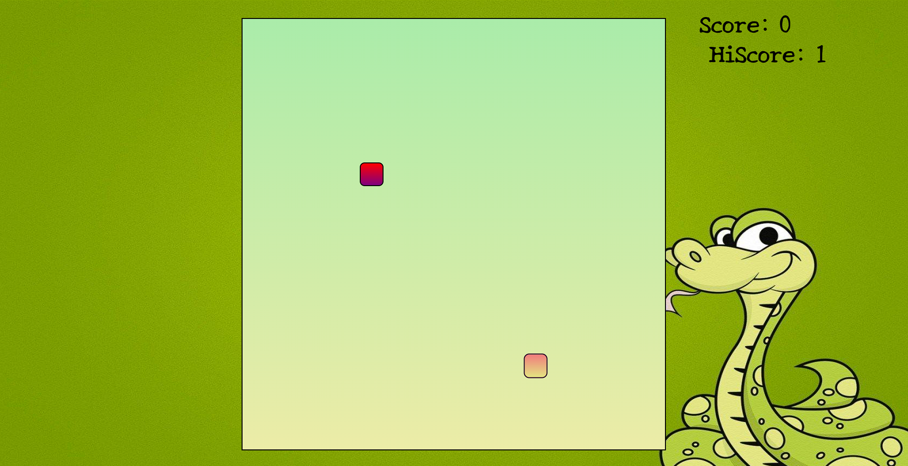

# 🐍 JS-SnackGame

A simple yet fun **Snake-inspired snack game** built using **HTML, CSS, and JavaScript**. Control the snake, eat the snacks, and challenge yourself to beat the highest score! 🎮

## 📌 Features
- 🎨 Simple and engaging UI
- 🐍 Smooth snake movement
- 🍎 Random snack spawning
- 📈 Score & High Score tracking
- 🚀 Fully responsive and lightweight

## 🖼️ Screenshot

## 🚀 Live Demo
🔗 **Play Now:** [GitHub Pages Link](https://js-snackgame-viru.netlify.app/)

## ⚡ How to Play?
1. **Start the game** – The snake appears on the screen.
2. **Control the snake** – Use the arrow keys (`← ↑ ↓ →`) to move.
3. **Eat the snacks** – Guide the snake to the snack to earn points.
4. **Avoid hitting walls** – If the snake touches the boundary, the game restarts.
